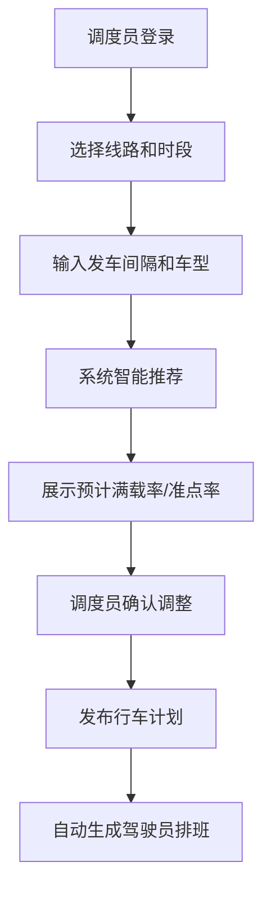
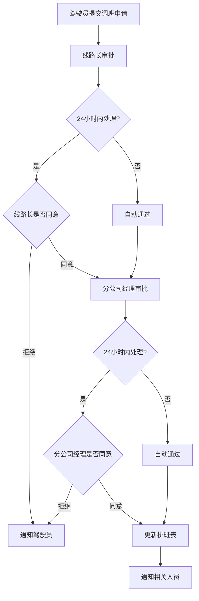
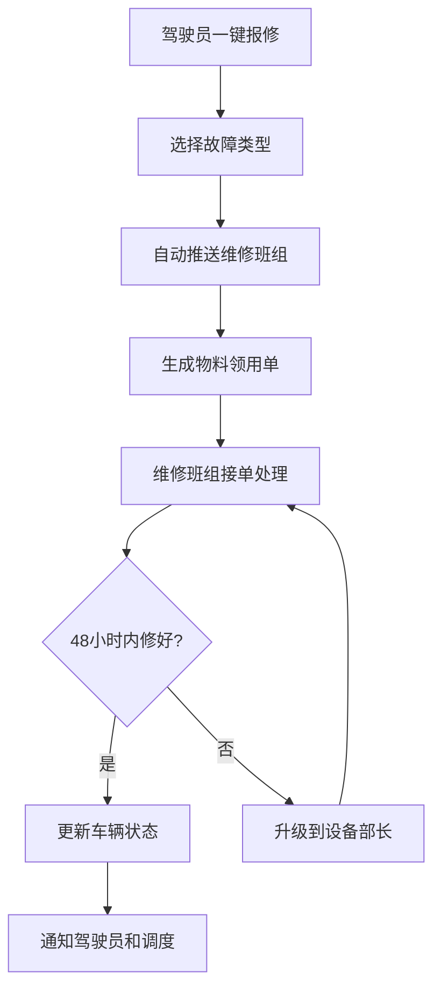

# 城市公交集团智慧运营调度管理平台 PRD

## 1. 产品概述

城市公交集团智慧运营调度管理平台是一套面向公交集团的综合运营管理系统，涵盖行车计划智能调度、驾驶员排班、车辆实时监控、客流分析、充电桩管理、故障报修等核心业务模块，通过数字化手段提升运营效率、降低管理成本。

- 解决传统调度效率低、排班不合理、车辆监控不及时、客流分析滞后等问题
- 目标用户包括集团管理员、分公司经理、线路长、调度员、驾驶员等四级角色
- 核心价值：智能调度降本增效，实时监控保障安全，数据驱动决策优化

## 2. 核心功能

### 2.1 用户角色

| 角色 | 注册方式 | 核心权限 |
|------|----------|----------|
| 驾驶员 | 管理员分配 | 查看个人任务和排班，申请调班，一键报修 |
| 线路长 | 管理员分配 | 管理本线路车辆和驾驶员，审批调班申请，查看线路运营数据 |
| 分公司经理 | 管理员分配 | 查看分公司全局数据，审批调班申请，管理分公司资源 |
| 集团管理员 | 系统初始化 | 调整调度参数和审批规则，管理全集团用户权限，导出运营报告 |

### 2.2 功能模块

1. **首页大屏**：实时展示各线路准点率、今日客流走势、在途车辆数、充电桩占用率、驾驶员出勤情况
2. **行车计划调度**：创建行车计划，智能推荐发车时刻和配车数，显示预计满载率和准点率
3. **驾驶员排班**：自动生成排班表，调班申请与两级审批，工时合规管理
4. **车辆实时监控**：GPS位置回传，偏离路线/堵车检测，异常弹窗提醒，应急车辆推送
5. **客流分析**：按站点客流热力分析，高平峰调整建议生成
6. **充电桩管理**：快慢桩管理，空闲桩位推荐，15分钟锁定机制，超时自动释放
7. **故障报修**：一键报修，自动推送维修班组，物料领用单生成，超时升级机制
8. **报表中心**：月度运营效率和成本分析报告，按分公司/线路/日期筛选，一键导出

### 2.3 页面详情

| 页面名称 | 模块名称 | 功能描述 |
|----------|----------|----------|
| 登录页 | 身份认证 | 账号密码登录，角色权限识别 |
| 首页大屏 | 数据概览 | 实时数据卡片、折线图、柱状图、饼图展示，5秒自动刷新 |
| 行车计划 | 计划列表 | 计划列表展示，状态筛选，新建/编辑/发布/作废操作 |
| 行车计划 | 计划创建 | 选择线路、时段，输入发车间隔和车型，智能推荐算法展示 |
| 驾驶员排班 | 排班日历 | 按月视图展示排班，拖拽调整，冲突检测 |
| 驾驶员排班 | 调班申请 | 申请列表，审批操作，24小时超时自动通过 |
| 车辆监控 | 实时地图 | 车辆位置标记，线路绘制，异常高亮 |
| 车辆监控 | 异常预警 | 异常列表，弹窗提醒，应急车辆调度 |
| 客流分析 | 热力图 | 站点客流热力展示，时段对比分析 |
| 客流分析 | 调整建议 | 高平峰时段识别，发车间隔调整建议 |
| 充电桩管理 | 桩位状态 | 充电桩列表，空闲/占用/故障状态，功率分类 |
| 充电桩管理 | 预约分配 | 车辆归场推荐，锁定/释放机制 |
| 故障报修 | 报修列表 | 故障工单列表，状态跟踪，48小时超时升级 |
| 故障报修 | 工单处理 | 维修班组分配，物料领用单生成 |
| 报表中心 | 报告生成 | 多维度筛选，数据可视化，Excel/PDF导出 |
| 系统设置 | 权限管理 | 用户角色管理，权限分配 |
| 系统设置 | 参数配置 | 调度参数调整，审批规则配置 |

## 3. 核心流程

### 3.1 行车计划创建流程

调度员登录系统，选择线路和运营时段，输入发车间隔和车型配置。系统基于历史客流数据和实时交通状况，通过智能算法计算最优发车时刻和配车数量，展示预计满载率和准点率。调度员确认后发布计划，系统自动生成驾驶员排班表。

### 3.2 调班审批流程

驾驶员在系统中提交调班申请，系统自动通知线路长审批。线路长在24小时内处理，若超时系统自动通过。线路长审批通过后，流转至分公司经理审批，同样24小时超时自动通过。审批完成后系统自动更新排班表并通知相关人员。

### 3.3 车辆故障报修流程

驾驶员发现车辆故障后，在系统中一键报修并选择故障类型。系统根据故障类型自动推送到对应维修班组，同时生成物料领用单。维修班组接单后进行维修，若48小时内未修复，系统自动升级到设备部长处理。维修完成后更新车辆状态。

## 4. 用户界面设计

### 4.1 设计风格

- **主色调**：深蓝色 (#165DFF)，代表专业、可靠、科技感
- **辅助色**：橙色 (#FF7D00) 用于警示和强调，绿色 (#00B42A) 表示正常状态，红色 (#F53F3F) 表示异常
- **中性色**：深灰 #1D2129、中灰 #4E5969、浅灰 #C9CDD4、背景 #F2F3F5
- **按钮风格**：圆角 6px，主按钮渐变效果，悬停有微动效
- **字体**：标题使用 "Noto Sans SC" 粗体，正文使用 "Noto Sans SC" 常规，等宽数据使用 "Roboto Mono"
- **布局风格**：侧边导航 + 顶部工具栏 + 主内容区，卡片式模块布局
- **图标风格**：线性图标，统一 24px 尺寸，颜色与状态关联

### 4.2 页面设计概览

| 页面名称 | 模块名称 | UI元素 |
|----------|----------|--------|
| 首页大屏 | 数据概览 | 深色背景，荧光数据卡片，动态折线图，滚动数据列表，呼吸动画效果 |
| 行车计划 | 计划创建 | 分步表单，智能推荐结果对比卡片，参数滑块调节 |
| 车辆监控 | 实时地图 | 地图背景，车辆图标动画，线路高亮绘制，异常弹窗 |
| 排班日历 | 排班视图 | 月历网格，拖拽调整，冲突红色提示，状态颜色标记 |
| 客流分析 | 热力图 | 站点地图热力叠加，时间轴滑块，对比柱状图 |

### 4.3 响应式设计

- 桌面端优先设计，适配 1920×1080 及以上分辨率
- 侧边导航可折叠，适配中小屏幕
- 表格支持横向滚动，移动端简化展示
- 数据图表自适应容器宽度

### 4.4 动效设计

- 页面加载：元素渐入 + 位移动画，延迟错落
- 数据刷新：数字滚动动画，图表平滑过渡
- 异常提醒：红色闪烁 + 脉冲动画，吸引注意力
- 卡片悬停：轻微上浮 + 阴影加深
- 弹窗出现：缩放 + 淡入，背景模糊
