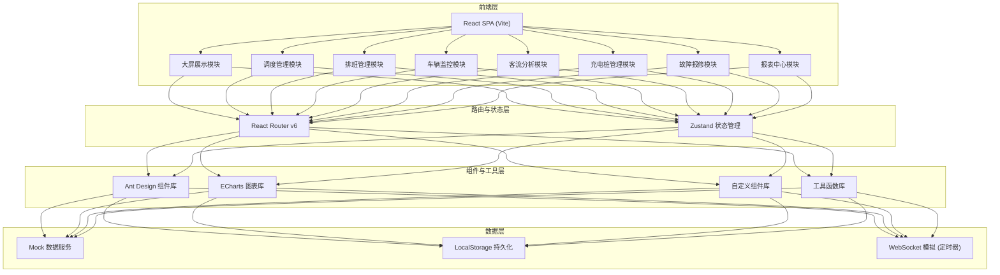

# 城市公交集团智慧运营调度管理平台 技术架构文档

## 1. 架构设计



## 2. 技术栈描述

### 2.1 前端核心技术
- **框架**: React@18.2.0 - 使用函数组件 + Hooks
- **构建工具**: Vite@5.0.0 - 快速开发和构建
- **语言**: TypeScript@5.3.0 - 类型安全
- **样式**: TailwindCSS@3.4.0 - 原子化CSS
- **路由**: React Router@6.20.0 - 单页路由
- **状态管理**: Zustand@4.4.0 - 轻量级状态管理

### 2.2 UI与可视化
- **组件库**: Ant Design@5.12.0 - 企业级组件
- **图表库**: ECharts@5.4.3 - 数据可视化
- **图标**: @ant-design/icons@5.2.0 - 图标库

### 2.3 工具与辅助
- **日期处理**: dayjs@1.11.10 - 轻量级日期库
- **HTTP请求**: axios@1.6.0 - 预留接口扩展
- **Mock数据**: 自定义Mock服务 - 模拟后端数据

### 2.4 代码规范
- ESLint + Prettier - 代码格式化
- TypeScript 严格模式

## 3. 路由定义

| 路由路径 | 页面名称 | 权限要求 | 说明 |
|----------|----------|----------|------|
| /login | 登录页 | 公开 | 用户身份认证 |
| /dashboard | 首页大屏 | 所有角色 | 实时数据展示大屏 |
| /schedule | 行车计划 | 调度员/线路长/经理/管理员 | 行车计划列表与创建 |
| /schedule/create | 创建计划 | 调度员/管理员 | 新建行车计划 |
| /roster | 排班管理 | 线路长/经理/管理员 | 驾驶员排班日历 |
| /roster/swap | 调班申请 | 所有角色 | 调班申请与审批 |
| /monitor | 车辆监控 | 线路长/经理/管理员 | 实时车辆地图监控 |
| /monitor/alerts | 异常预警 | 线路长/经理/管理员 | 异常事件列表与处理 |
| /passenger | 客流分析 | 经理/管理员 | 客流热力与分析 |
| /charging | 充电桩管理 | 调度员/经理/管理员 | 充电桩状态与分配 |
| /repair | 故障报修 | 所有角色 | 故障工单处理 |
| /reports | 报表中心 | 经理/管理员 | 运营报告生成与导出 |
| /settings | 系统设置 | 管理员 | 参数配置与权限管理 |

## 4. 核心数据类型定义

```typescript
// 用户与权限
interface User {
  id: string;
  name: string;
  role: 'driver' | 'leader' | 'manager' | 'admin';
  branchId: string;
  phone: string;
  avatar?: string;
}

// 分公司
interface Branch {
  id: string;
  name: string;
  address: string;
  managerId: string;
}

// 线路
interface Route {
  id: string;
  name: string;
  code: string;
  branchId: string;
  leaderId: string;
  stations: Station[];
  distance: number;
  duration: number;
}

// 站点
interface Station {
  id: string;
  name: string;
  lng: number;
  lat: number;
  sequence: number;
}

// 车辆
interface Bus {
  id: string;
  plateNumber: string;
  type: 'electric' | 'hybrid' | 'fuel';
  model: string;
  capacity: number;
  branchId: string;
  status: 'idle' | 'running' | 'charging' | 'repair' | 'maintenance';
  currentRouteId?: string;
  currentLng?: number;
  currentLat?: number;
  batteryLevel?: number;
}

// 驾驶员
interface Driver {
  id: string;
  userId: string;
  name: string;
  employeeNo: string;
  branchId: string;
  licenseLevel: 'A1' | 'A3';
  skills: string[];
  totalWorkHours: number;
  monthlyWorkHours: number;
  status: 'on' | 'off' | 'leave' | 'rest';
}

// 行车计划
interface SchedulePlan {
  id: string;
  routeId: string;
  branchId: string;
  date: string;
  timeSlot: 'morning' | 'noon' | 'evening' | 'night' | 'all';
  startTime: string;
  endTime: string;
  intervalMinutes: number;
  busType: string;
  busCount: number;
  estimatedLoadRate: number;
  estimatedOnTimeRate: number;
  status: 'draft' | 'published' | 'executing' | 'completed' | 'cancelled';
  createdBy: string;
  createdAt: string;
  trips: ScheduleTrip[];
}

// 班次
interface ScheduleTrip {
  id: string;
  planId: string;
  departureTime: string;
  busId: string;
  driverId: string;
  sequence: number;
}

// 排班记录
interface RosterEntry {
  id: string;
  driverId: string;
  date: string;
  shiftType: 'morning' | 'middle' | 'evening' | 'rest' | 'leave';
  tripIds: string[];
  workHours: number;
}

// 调班申请
interface SwapRequest {
  id: string;
  requesterId: string;
  targetDriverId?: string;
  date: string;
  originalShift: RosterEntry;
  requestedShift?: RosterEntry;
  reason: string;
  status: 'pending' | 'leader_approved' | 'manager_approved' | 'rejected' | 'auto_approved';
  leaderApprovedAt?: string;
  managerApprovedAt?: string;
  createdAt: string;
}

// 车辆实时数据
interface BusTelemetry {
  id: string;
  busId: string;
  timestamp: string;
  lng: number;
  lat: number;
  speed: number;
  direction: number;
  status: 'normal' | 'deviated' | 'traffic_jam' | 'stopped';
}

// 异常事件
interface AlertEvent {
  id: string;
  type: 'route_deviation' | 'traffic_jam' | 'overtime_stop' | 'speeding' | 'emergency';
  busId: string;
  routeId: string;
  timestamp: string;
  lng: number;
  lat: number;
  severity: 'low' | 'medium' | 'high' | 'critical';
  status: 'new' | 'acknowledged' | 'resolved';
  description: string;
  nearestBusIds?: string[];
}

// 客流数据
interface PassengerData {
  id: string;
  stationId: string;
  routeId: string;
  date: string;
  hour: number;
  passengerCount: number;
  isPeak: boolean;
}

// 充电桩
interface ChargingPile {
  id: string;
  name: string;
  type: 'fast' | 'slow';
  power: number;
  branchId: string;
  location: string;
  status: 'idle' | 'occupied' | 'locked' | 'faulty';
  currentBusId?: string;
  lockedBy?: string;
  lockedUntil?: string;
}

// 故障工单
interface RepairTicket {
  id: string;
  busId: string;
  reporterId: string;
  faultType: 'engine' | 'electric' | 'brake' | 'tire' | 'body' | 'other';
  description: string;
  severity: 'minor' | 'major' | 'critical';
  status: 'new' | 'assigned' | 'in_progress' | 'waiting_parts' | 'completed' | 'escalated';
  assignedTeamId?: string;
  materialList: MaterialItem[];
  createdAt: string;
  startedAt?: string;
  completedAt?: string;
  escalatedAt?: string;
}

// 物料项
interface MaterialItem {
  id: string;
  name: string;
  quantity: number;
  unit: string;
  status: 'requested' | 'issued' | 'returned';
}
```

## 5. 目录结构

```
src/
├── assets/              # 静态资源
│   ├── images/
│   └── styles/
├── components/          # 通用组件
│   ├── Layout/          # 布局组件
│   ├── Charts/          # 图表组件
│   ├── DataCards/       # 数据卡片
│   └── common/          # 基础组件
├── pages/               # 页面组件
│   ├── Login/
│   ├── Dashboard/
│   ├── Schedule/
│   ├── Roster/
│   ├── Monitor/
│   ├── Passenger/
│   ├── Charging/
│   ├── Repair/
│   ├── Reports/
│   └── Settings/
├── store/               # 状态管理
│   ├── useUserStore.ts
│   ├── useBusStore.ts
│   ├── useScheduleStore.ts
│   └── index.ts
├── services/            # 数据服务
│   ├── mock/            # Mock数据
│   ├── api.ts
│   └── websocket.ts     # 模拟实时数据
├── types/               # TypeScript类型定义
│   └── index.ts
├── utils/               # 工具函数
│   ├── date.ts
│   ├── algorithm.ts     # 调度算法
│   └── permission.ts    # 权限判断
├── hooks/               # 自定义Hooks
│   ├── useRealTime.ts
│   ├── usePermission.ts
│   └── useChartData.ts
├── router/              # 路由配置
│   └── index.tsx
├── App.tsx
└── main.tsx
```

## 6. 核心算法说明

### 6.1 智能调度算法

```typescript
// 输入：线路ID、日期、时段、发车间隔、车型
// 输出：推荐发车时刻列表、配车数、预计满载率、预计准点率
function calculateOptimalSchedule(
  routeId: string,
  date: string,
  timeSlot: TimeSlot,
  interval: number,
  busType: string
): ScheduleRecommendation {
  // 1. 获取历史同时段客流数据
  // 2. 获取实时交通拥堵指数
  // 3. 计算基准发车频率
  // 4. 根据客流动态调整间隔
  // 5. 计算所需车辆数
  // 6. 预估满载率和准点率
}
```

### 6.2 驾驶员排班算法

```typescript
// 输入：行车计划、可用驾驶员列表
// 输出：排班表
function generateRoster(
  plan: SchedulePlan,
  drivers: Driver[]
): RosterEntry[] {
  // 1. 计算每个班次所需工时
  // 2. 检查驾驶员资质匹配
  // 3. 检查工时合规（连续工作不超过8小时）
  // 4. 均衡分配工作时长
  // 5. 考虑驾驶员历史偏好
}
```

## 7. 实时数据刷新机制

- 使用 `setInterval` 模拟 WebSocket 实时推送
- 首页大屏数据每 5 秒刷新一次
- 车辆监控位置每 3 秒更新一次
- 异常事件使用 EventEmitter 主动推送
- 数据更新时使用数字滚动动画过渡
